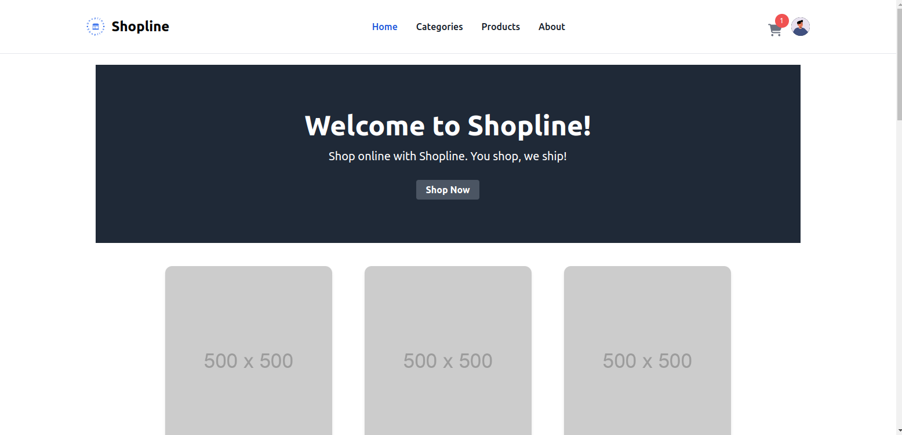
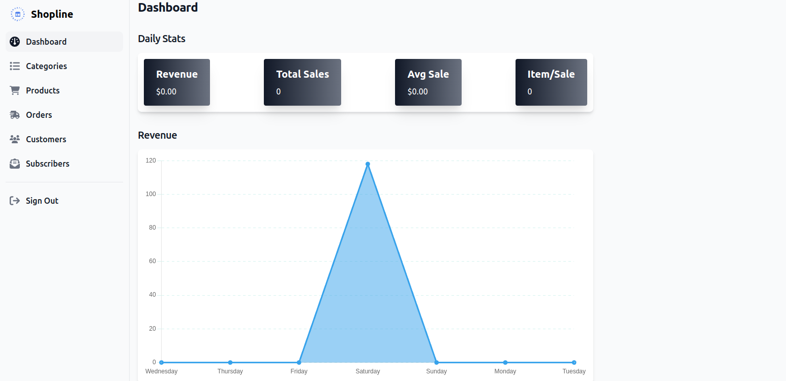
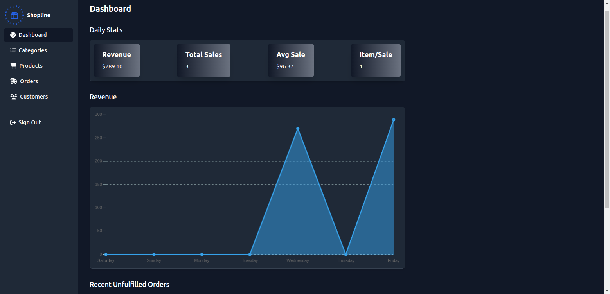
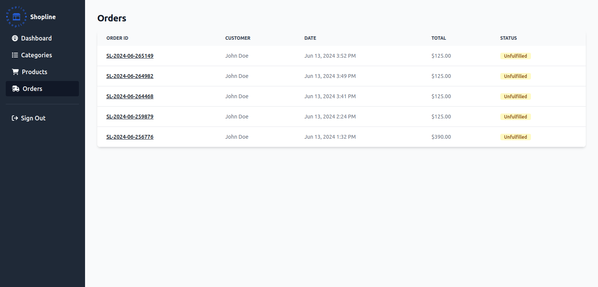
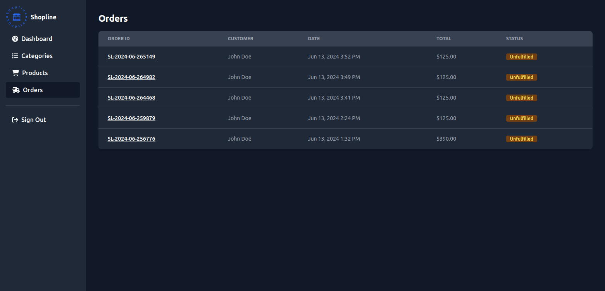

# Shopline

[](https://github.com/binos30/shopline/actions/workflows/ci.yml)
[](https://dependabot.com)

E-commerce app. Shop online with Shopline. You shop, we ship!







## Setup

Prerequisites

- [Ruby 3.3.4](https://github.com/rbenv/rbenv)
- [PostgreSQL](https://www.postgresql.org/download/)
- [Node.js ^20.15.1](https://github.com/nvm-sh/nvm)

Create `.env` file at the root of the project directory. Copy the content of `.env.template.erb` to `.env` then update the `username` and `password` based on your database credentials. Get `STRIPE_SECRET_KEY` and `STRIPE_WEBHOOK_SECRET` from your [Stripe](https://dashboard.stripe.com) account

Install dependencies and setup database

```bash
bin/setup
```

Start local web server

```bash
bin/dev
```

Go to [http://localhost:3000](http://localhost:3000)

Use [Stripe CLI](https://docs.stripe.com/stripe-cli) to simulate Stripe events in your local environment or [learn more about Webhooks](https://docs.stripe.com/webhooks)

```bash
stripe listen --forward-to localhost:3000/stripe_webhooks
```

## Testing Payments

To test Stripe payments, use the following test card details:

- Card Number: `4242 4242 4242 4242`
- Expiration: Any future date
- CVC: Any 3-digit number

## Set up a production Stripe webhook

1. Go to the [Stripe Dashboard](https://dashboard.stripe.com) and create a new webhook for your production environment.
2. Set the endpoint URL to your production route (e.g., `https://yourdomain.com/stripe_webhooks`).
3. Select the events you want to listen for (e.g., `checkout.session.completed`, `customer.created`).

## Testing

Setup test database

```bash
bin/rails db:test:prepare
```

Default: Run all spec files (i.e., those matching spec/\*\*/\*\_spec.rb)

```bash
bin/rspec
```

Run all spec files in a single directory (recursively)

```bash
bin/rspec spec/models
```

Run a single spec file

```bash
bin/rspec spec/models/product_spec.rb
```

Run a single example from a spec file (by line number)

```bash
bin/rspec spec/models/product_spec.rb:8
```

See all options for running specs

```bash
bin/rspec --help
```
