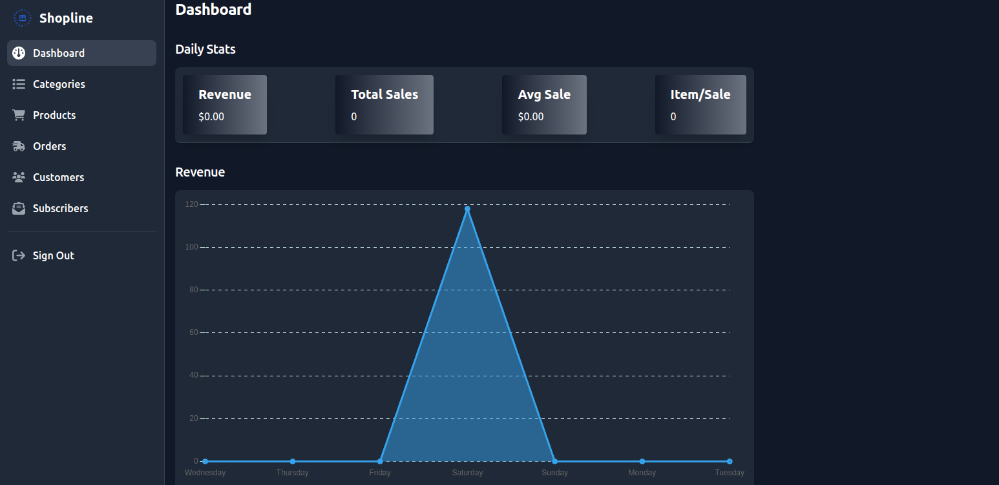
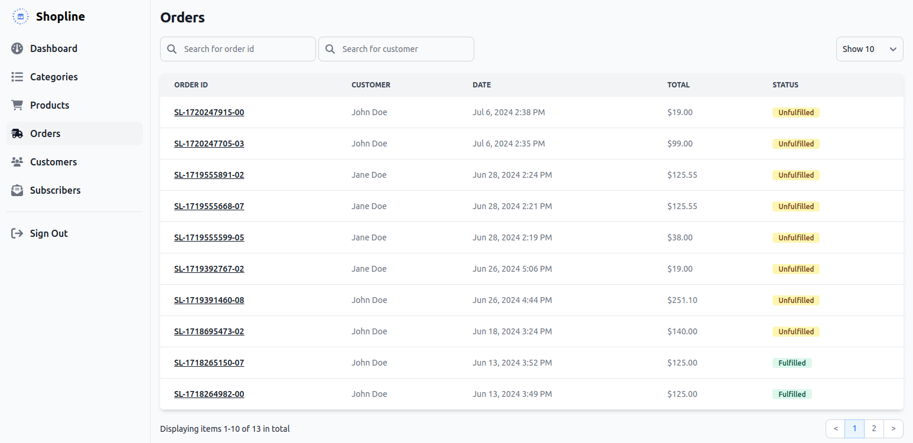

# Shopline

[](https://github.com/binos30/shopline/actions/workflows/ci.yml)
[](https://dependabot.com)

E-commerce app. Shop online with Shopline. You shop, we ship!






## Setup

Prerequisites

- [Ruby 3.3.5](https://github.com/rbenv/rbenv)
- [PostgreSQL](https://www.postgresql.org/download/)
- [Node.js ^20.15.1](https://github.com/nvm-sh/nvm)

Create `.env` file at the root of the project directory. Copy the content of `.env.template.erb` to `.env` then update the `username` and `password` based on your database credentials. Get `STRIPE_SECRET_KEY` and `STRIPE_WEBHOOK_SECRET` from your [Stripe](https://dashboard.stripe.com) account

Install dependencies and setup database

```bash
bin/setup
```

Start local web server

```bash
bin/dev
```

Go to [http://localhost:3000](http://localhost:3000)

Use [Stripe CLI](https://docs.stripe.com/stripe-cli) to simulate Stripe events in your local environment or [learn more about Webhooks](https://docs.stripe.com/webhooks)

```bash
stripe listen --forward-to localhost:3000/stripe_webhooks
```

## Testing Payments

To test Stripe payments, use the following test card details:

- Card Number: `4242 4242 4242 4242`
- Expiration: Any future date
- CVC: Any 3-digit number

## Set up a production Stripe webhook

1. Go to the [Stripe Dashboard](https://dashboard.stripe.com) and create a new webhook for your production environment.
2. Set the endpoint URL to your production route (e.g., `https://yourdomain.com/stripe_webhooks`).
3. Select the events you want to listen for (e.g., `checkout.session.completed`, `customer.created`, `customer.deleted`).

## GitHub Actions, Linting and Security Auditing

GitHub actions are setup to lint and test the application on pushes to **main** and **feature** branches. It's also setup to deploy the application on pushes to **main**

You can also run these actions locally before pushing to see if your run is likely to fail. See the following gems / commands for more info.

- [Brakeman](https://brakemanscanner.org/) - Security audit application code

  ```bash
  bin/brakeman --no-pager
  ```

- [Brakeman: Ignoring False Positives](https://brakemanscanner.org/docs/ignoring_false_positives) - Creating and Managing an Ignore File

  ```bash
  bin/brakeman -I --no-pager
  ```

- [Rubocop Rails Omakase](https://github.com/rails/rubocop-rails-omakase) - Ruby Linter

  ```bash
  bin/rubocop
  ```

  **Note:** Some linters like `ESLint`, `Prettier`, etc. will automatically run on `pre-commit` git hook.

## Testing

Setup test database

```bash
bin/rails db:test:prepare
```

Default: Run all spec files (i.e., those matching spec/\*\*/\*\_spec.rb)

```bash
bin/rspec
```

or with `--fail-fast` option to stop running the test suite on the first failed test. You may add a parameter to tell RSpec to stop running the test suite after N failed tests, for example: `--fail-fast=3`

```bash
bin/rspec --fail-fast
```

Run all spec files in a single directory (recursively)

```bash
bin/rspec spec/models
```

Run a single spec file

```bash
bin/rspec spec/models/product_spec.rb
```

Run a single example from a spec file (by line number)

```bash
bin/rspec spec/models/product_spec.rb:6
```

Use the plain-English descriptions to generate a report of where the application conforms to (or fails to meet) the spec

```bash
bin/rspec --format documentation
```

```bash
bin/rspec --format documentation spec/models/product_spec.rb
```

See all options for running specs

```bash
bin/rspec --help
```

## Code Coverage

[Coverage]: https://docs.ruby-lang.org/en/3.3/Coverage.html "API doc for Ruby's Coverage library"
[SimpleCov]: https://github.com/simplecov-ruby/simplecov "A code coverage analysis tool for Ruby"

[SimpleCov][SimpleCov] is a code coverage analysis tool for Ruby. It uses [Ruby's built-in Coverage][Coverage] library to
gather code coverage data, but makes processing its results much easier by providing a clean API to filter, group, merge, format,
and display those results, giving you a complete code coverage suite that can be set up with just a couple lines of code.
SimpleCov/Coverage track covered ruby code, gathering coverage for common templating solutions like erb, slim and haml is not supported.

After running your tests, open `coverage/index.html` in the browser of your choice. For example, in a Mac Terminal,
run the following command from your application's root directory:

```bash
open coverage/index.html
```

in a debian/ubuntu Terminal,

```bash
xdg-open coverage/index.html
```

**Note:** [This guide](https://dwheeler.com/essays/open-files-urls.html) can help if you're unsure which command your particular
operating system requires.
