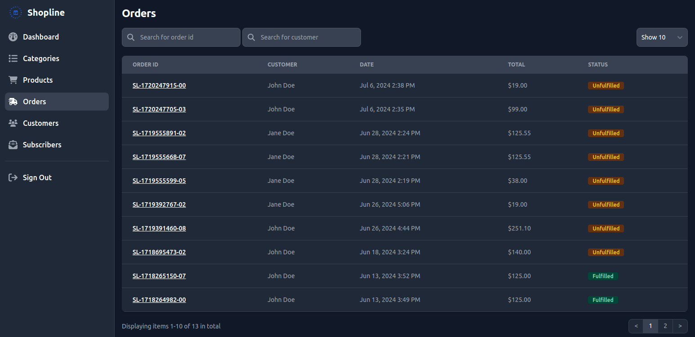

# Shopline

[](https://github.com/binos30/shopline/actions/workflows/ci.yml)
[](https://dependabot.com)

E-commerce app. Shop online with Shopline. You shop, we ship!




## Setup

Prerequisites

- [Ruby 3.3.3](https://www.ruby-lang.org/en/downloads/)
- [PostgreSQL](https://www.postgresql.org/download/)
- [Node.js 20.15.0](https://nodejs.org/en/blog/release/v20.15.0)

Create `.env` file at the root of the project directory. Copy the content of `.env.template.erb` to `.env` then update the `username` and `password` based on your database credentials. Get `STRIPE_SECRET_KEY` and `STRIPE_WEBHOOK_SECRET` from your [Stripe](https://dashboard.stripe.com) account

Install dependencies and setup database

```bash
bin/setup
```

Start local web server

```bash
bin/dev
```

Go to [http://localhost:3000](http://localhost:3000)

Use [Stripe CLI](https://docs.stripe.com/stripe-cli) to simulate Stripe events in your local environment or [learn more about Webhooks](https://docs.stripe.com/webhooks)

```bash
stripe listen --forward-to localhost:3000/stripe_webhooks
```

## Testing

Setup test database

```bash
bin/rails db:test:prepare
```

Default: Run all spec files (i.e., those matching spec/\*\*/\*\_spec.rb)

```bash
bin/rspec
```

Run all spec files in a single directory (recursively)

```bash
bin/rspec spec/models
```

Run a single spec file

```bash
bin/rspec spec/models/product_spec.rb
```

Run a single example from a spec file (by line number)

```bash
bin/rspec spec/models/product_spec.rb:8
```

See all options for running specs

```bash
bin/rspec --help
```
